

# 🚗✨ Vehicle Orders Dashboard

### 📊 Power BI | Interactive Business Intelligence Project

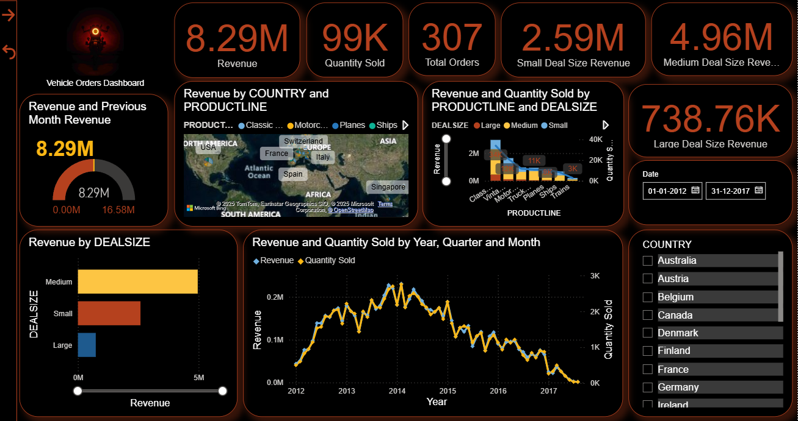

 

---

## 🌟 Overview

🚀 This project is a **fully interactive Power BI dashboard** designed to analyze vehicle sales across:

* 💰 Revenue
* 📦 Quantity Sold
* 🌍 Country Performance
* 🚘 Product Line
* 📊 Deal Size

---

## 🎬 Dashboard Preview

  

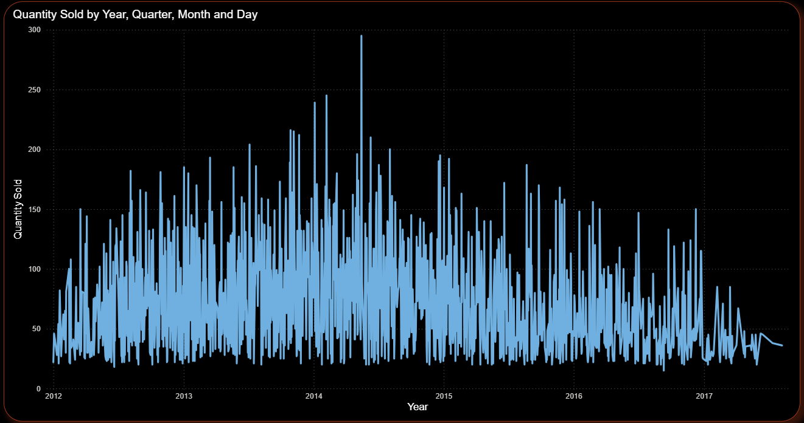
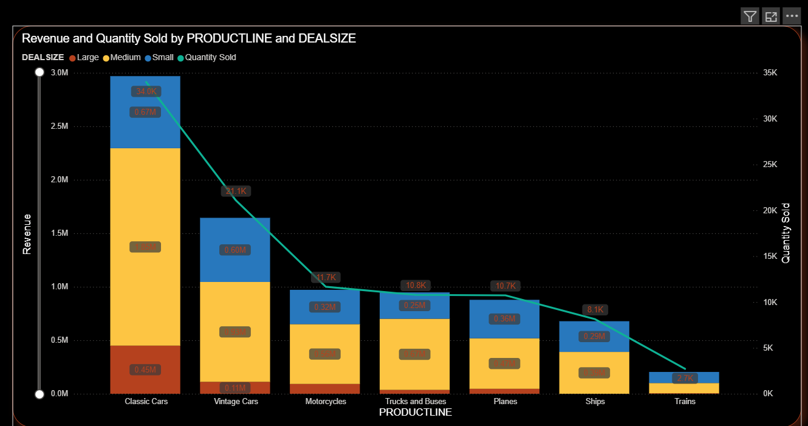

  

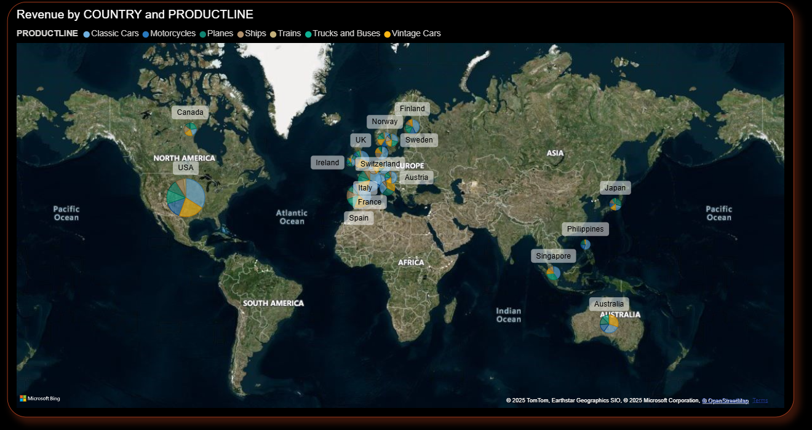
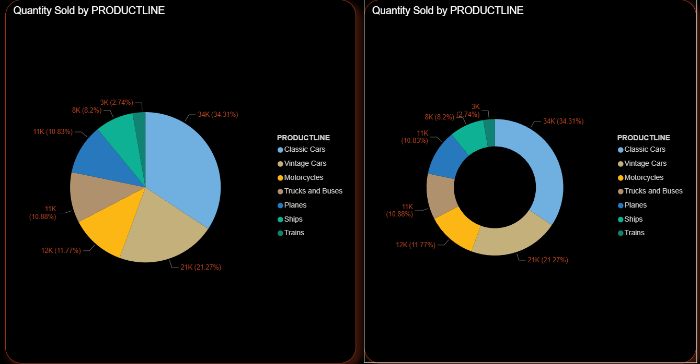

  

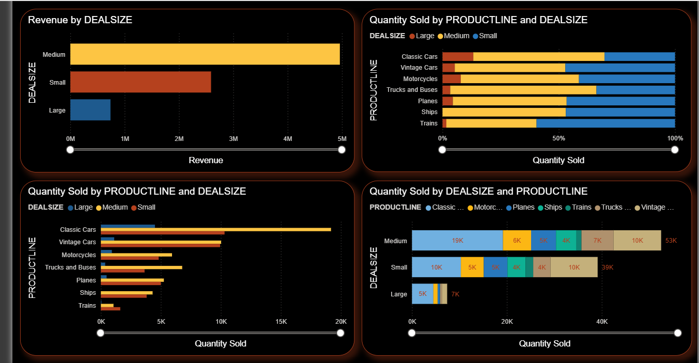
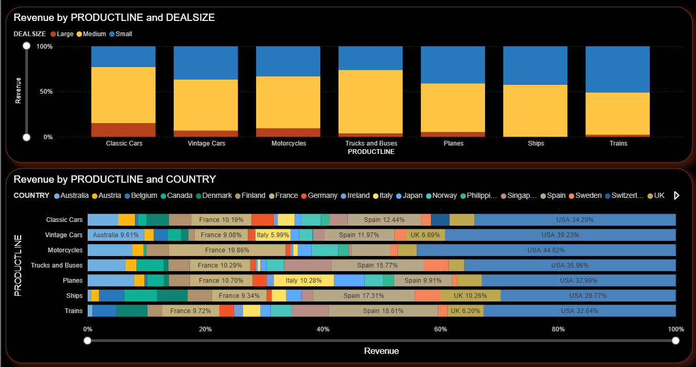

  

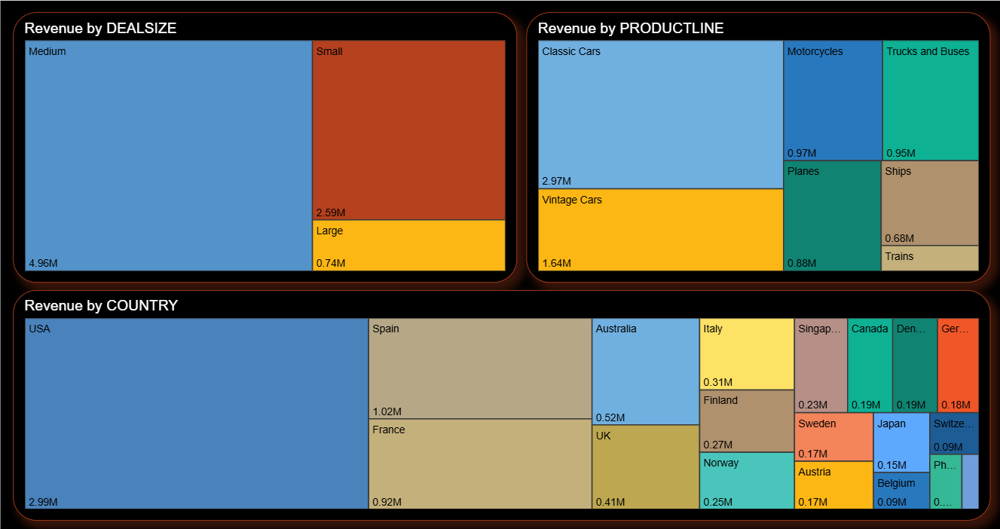
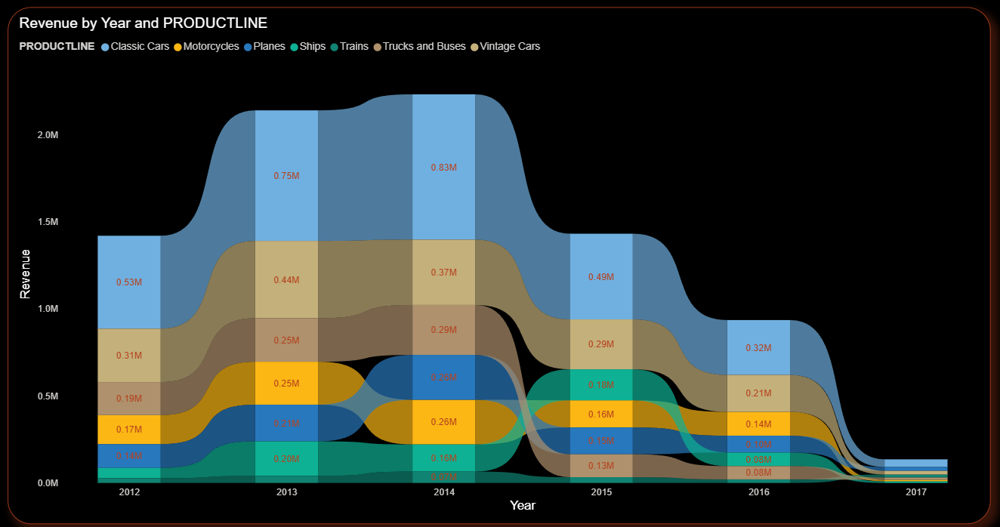

  

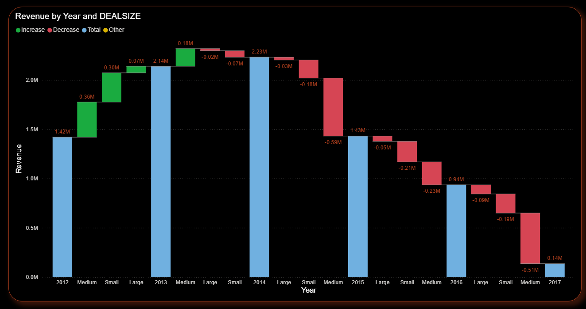
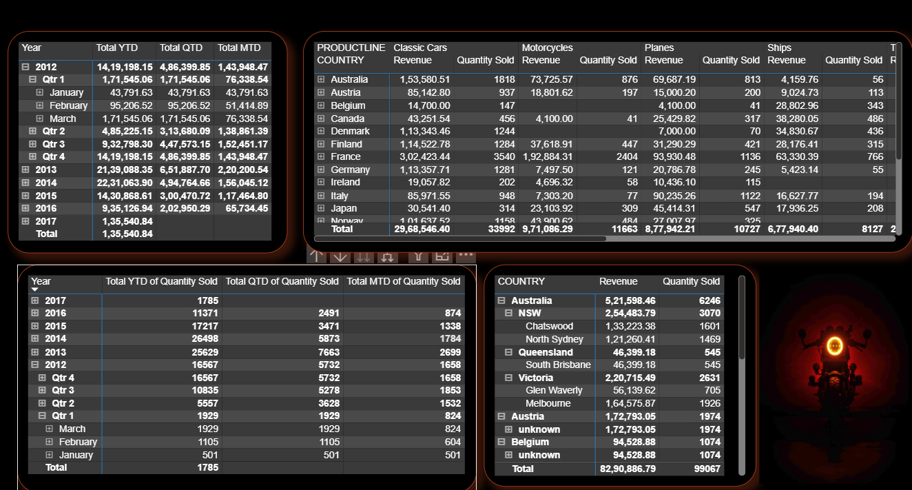

  

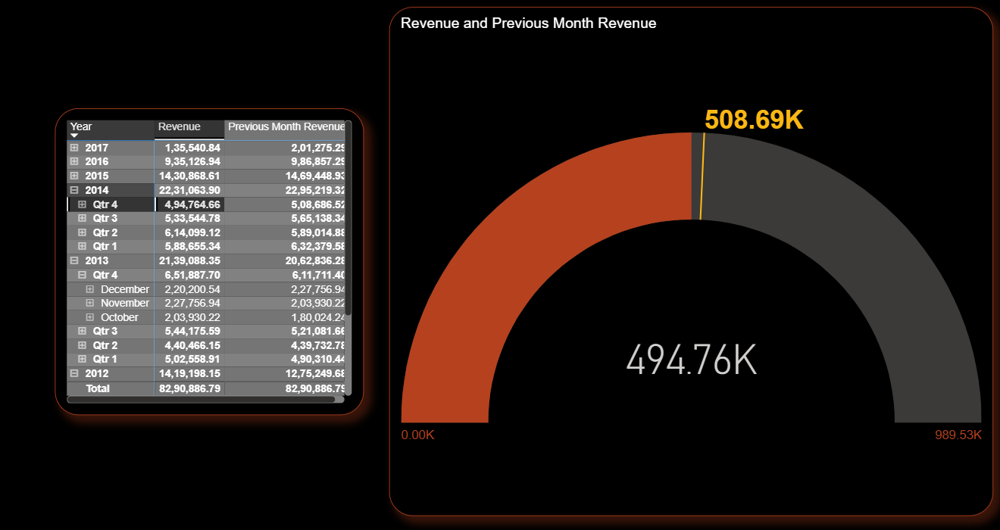
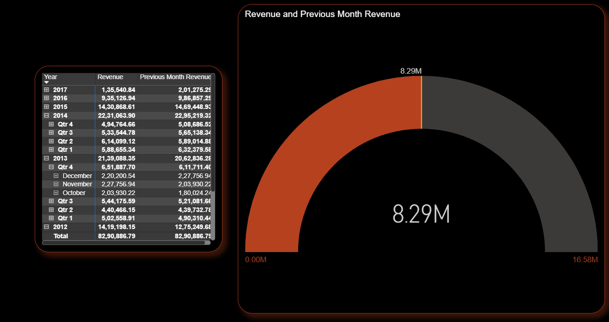

---

## ⚡ Key Metrics

| 📊 Metric      | 💡 Value  |
| -------------- | --------- |
| 💰 Revenue     | **8.29M** |
| 📦 Quantity    | **99K**   |
| 🧾 Orders      | **307**   |
| 📈 Medium Deal | **4.96M** |

---

## 🔥 Key Insights

✨ Classic Cars generate highest revenue
🌍 USA dominates global sales
📊 Medium deal size is most profitable
📉 Revenue declines after 2014
🚢 Ships & Trains contribute least

---

## 🎨 Features

✔️ Interactive slicers & filters
✔️ KPI cards & gauges
✔️ Time intelligence (YTD, QTD, MTD)
✔️ Geo analysis
✔️ Drill-down capability

---

## 🛠️ Tech Stack

* 📊 Power BI
* 🧠 DAX
* 📁 Data Modeling
* 📄 Excel

---

## 🚀 How to Use

1. Download `.pbix`
2. Open in Power BI
3. Explore dashboard

---

### ⭐ If you like this project, give it a star! ⭐

